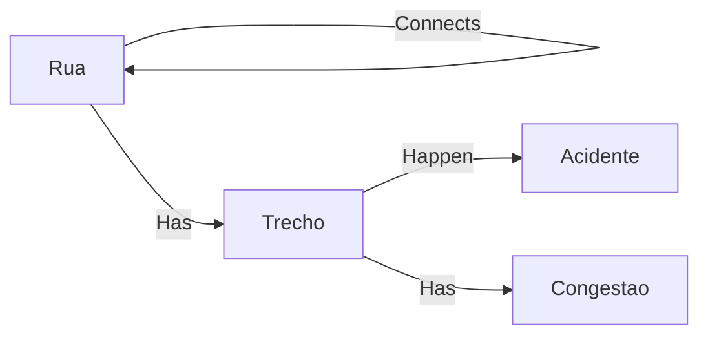

# Traffic Jammer

## The Product
Traffic Jammer is a web application that allows you to view traffic close to you (as a regular user) and manage your city through a very detailed dashboard (administrator). Features include:
* Simple interface for visualizing the traffic around you, don't waste time in traffic anymore.
* Relevant statistics concerning your city's roads including: roadbloack, traffic jams and car crashes.
* Beautiful and easily usable interface both for clients and administration.

## Team
Team Manager - Tomás 
Product Owner - Mota
Architect - Joao
DevOps master - Pedro

## User Stories
O João é um estudante universitário que vive em Ilhavo e estuda em Aveiro. Antes de sair de casa quer saber como está o transito no caminho até o departamento dele, para saber o melhor caminho e ter uma boa noção do tempo que vai demorar.

A Maria trabalha para a Camara Municipal de Esgueira. Precisa de saber as zonas de maior congestionamento nas localidades à volta dela para poder enventualmente aprovar medidas que melhorem a situação e saber quais são as ruas com prioridade maior. Recebendo estatisticas sobre as taxas de acidente também ajuda para formar uma decisao informada.

## Work notes
We will work using an Agile Method, scrum-based, where we will meet every week to talk about what has been done or developped since last meeting. Also to update the backlog and define what will be done in our next sprint.

Our repository will be GitLab, where we can share our documents. We chose GitLab because it implements the good features from GitHub that we are used to, but also allow to do continuous delivery and automated that this process requires.

###  Choosing the Database system
We need someting that's capable of doing more than just key-value search, something that is capable of querrying by the values of the street, like searching the most congestioned, the safest streets, which implies averaging the amount of accidents per year, etc.

We don't need to do exact, atomic transactions, and, in this project, an approximate result is enough to get what we want. Knowing this, mongoDB *seems* to be the most ideal technology.However, due to having less experience in MongoDB, and both Mongo and SQL Server can work for our purpose, we're going to choose SQL server, as we have more experience with it and know more details about querying.

 - Rua is a table with the attributes: 
     - Name of street, 
     - beginning coordinates, 
     - ending coordinates, 
     - length, 
     - autogenerated long ID number for primary key;
 - Trecho is a weak entity:
     - Boolean value for increasing (True) vs decreasing(False) to distinguish directions
     - ID of street
     - Beginning coordinates
     - Number of cars
     - Int value for accident 
     - Prime key: id+bool+beginning
 - Acidente is basically a logger entity:
     - Date of accident
     - Coordinates for the accident (know the exact place)
 - Congestao is another logger:
     - Date of congestion
Messaging queue may be done with RabbitMQ since we already have some knowledge using it from previous classes.

Backend will be done in Django, since one of our programmers can never seem to get Maven right, and as Django is done in Python, which is a languange the whole development team is already very familiar with, and is simpler and more straightforward in terms of handling HTTP requests.

Front end development may be done with ReactJS, depending on how Tomas feels about it lmao. (easier if we also want the app, as we only need to develop once)

Interface has to be seen afterwards with Tomas, but with the information at the moment we can either just try to get the most out of the Google API, or just do a simple interface from scratch that takes a very minimalistic graph or a simple grid. (Either way we will need to manually integrate and create streets)

## What the client wants?
Traffic point of the user: como está o transito à volta dele?
Street statistics: estatisticas de acidente, trafico medio, que rua se conecta a qual, comprimento da rua, inicio e 
Extra: Route dum sitio (if able)

## Street attributes

## Roles
Team Manager - Tomas 
Product Owner - Mota
Architect - Joao
DevOps master - Pedro

### Notes
We are the group 35
det-engsoft-14.ua.pt
Use
