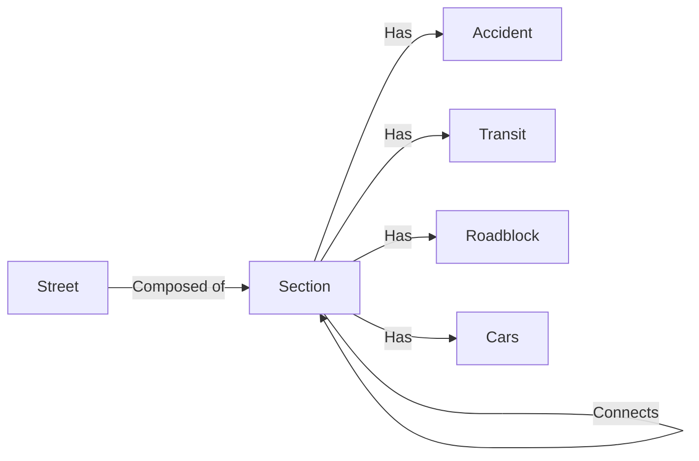

# Final Report

## Product Abstract
Traffic Jammer is a web application that allows you to view traffic close to you (as a regular user) and manage your city through a very detailed dashboard (administrator). Users with special access (admins) can also create new streets on each city. Features include:
* Simple interface for visualizing the traffic around you, don't waste time in traffic anymore.
* Relevant statistics concerning your city's roads including: roadbloack, traffic jams and car crashes.
* Beautiful and easily usable interface both for clients and administration.
* Track specific cars in a given city.

## Relevant Links
* [API Documentation](#API)
* [Frontend Documentation](#WebApplication)
* [Website](http://192.168.160.237:8800)
* [API Endpoint](http://192.168.160.237:8000)
* [Prototype](https://gitlab.com/myiesgroup/iesproject_trafficjammer/tree/master/Prototype)
* [Project Guidelines](https://gitlab.com/myiesgroup/iesproject_trafficjammer/blob/master/Reports/ProjectGuidelines.pdf)
* [Work Tracker](https://gitlab.com/myiesgroup/iesproject_trafficjammer/-/boards)

## Requirements
The basic requirements for the implementation of this project were:
 * aa

## Architecture

## SensorData​

### City creation  
​
In order to watch this project working we needed to introduce cities to the DataBase.  
A set of streets belonging to a city was generated with a Python script and fed to the API. After the insertion of the data, a set of Sections was returned that will be used later on.  
​
### Sensor Virtualization  
​
The main goal with this part of the data generation is to sucessfully replace real sensors by a script that generates data in a similar,close to real,way.  
We could opt to create a set of static messages to recreate the same scenario every time but we decided to go for a more bold move and let the messages be created randomly by a somewhat consistent virtual sensor.  
Initially, our intention was have a raspberry generating full time data for us, but since we could not get one in time and probably wasn't worth it (due to the low computacional capacity), we decided to run this sensors in our own PCs.  
​
The previously returned sections are divisions of the generated streets.
These sections are required for the next step (virtualization of sensor data). It was needed to run a few more python scripts on this sections to put them in the desired way, for example find all the connections between Sections so that in the simulation, cars would go from one section to another without magicaly appearing in the order side of the map. Note as well that this responsability should not be from the server, as this consistency in sensor virtualization would not be a concern in a real word project.  
​
>python3 doEverything.py fileContainingStreets CityName  
​
Would send the server the information required to create a city as well as processing the returning data in the desired way. The result, a file named CityName.txt wich would be fed to the sensors script (this file contains the connections of every section to facilitate consistency).  
​
#### Send.py
​
Send.py is the main script of data generation. It a producer sensor that generates various types of messages and stores them in RabbitMQ queues.  
In total,we have 5 different sensors,each one with different responsibilities:  
​
- Car movements -> Adds cars or removes cars from sections, being it that cars can move from one street to the other if these streets connect.
- Police Location -> Adds and removes police to and from some streets
- Road blocked -> Adds and removes roadblocks (anything that impedes traffic)
- Accident Location -> Adds and/or removes accidents from a section, adds the specific coordinates in a given section
- Visibility -> Alters the visibility of the some sections, being it that less visibility makes it harder to drive
​
As said before, these messages are stored in 2 RabbitMQ queues (Car movements gets a queue of his own due to high loads of data generation,this is done in order to unsynchronization issues in the other messages).  
Without getting in unecessary details, this script uses one of the API GET methods to have an idea of the internal state of the data in the DataBase, and then, from there continuosly generates messages to get the simulation running.  
Note, that the information about cars and sections is only asked once, and from there the script keeps a representation of the data so that the server doesn't need to perform unecessary work, this is because of how these setups/sensors would behave in the real world as mentioned above.  
All the other messages are not very costly so before creating them the server gives information about police locations, etc.
​
The messages are json Objects, for example:
​
- {"type": "insert", "id" : 5, "plate":AL16PO, "city": "Ilhavo"}
- {"type":"visibility", "id":6, "visibility": 50, "city":"Ilhavo"}
​
>python3 send.py ConnectionsFile(retured by doEverything.py)  
​
#### Receive.py
​
Receive.py is the consumer of Rabbit-MQ and his target is to process and forward the sensor messages to the server using the API methods.  
Since the there are a lot of car movements messages and our group had issues with performance in early tests, this data is sent in *bulk mode* to the server to minimize the communication between this end of the queue and the server (100 messages are aggregated before they are sent to the server).The messages sent in these *bulk mode* maintain the order that they were generated in.
​
>python3 receive.py  
​
We can have has many sends running (1 for each city) as we want, but we only need one receive.

## Server
### Why Django?
    1. Django in a overall aspect is simpler and has the least ceremony which leads to a more productive environment.
    2. Django, unlike, Spring has less mental overhead, there are no Beans,XML configurations, dependencies to be injected... This makes Django easier to understand and to start developing ,this helps the programmer enjoy the project working on.
    3. Django Admin is a really good aspect and feature that makes it easier to understand the environment and see what is going on.
    4. Django is in 979 company stacks while Spring is only in 316 stacks this makes it that programmers are more inclined to choose Django, and with more people working on it comes more ways to find out your problems and more well-rounded solutions to common problems. Django also has one of the best all around documentation.
    5- Starting a prototype and evolving from a small concept to a big fully functionaly product is simple and can be done even without any pre-defined structure.
    6- Django guides us throughout the project, by default it creates the basic needs for everything to work and we just scale it from there.
    7- Django isn't as capable in terms of big enterprise projects as Spring, but due to our small reach requirements Django was already a tool with more capabilities than we needed so it was a no brainer to use a tool that was harder to work with for this job.
    
### Why RabbitMQ?
    1.RabbitMQ is a simple and effective message queueing broker.
    2.RabbitMQ supports a wide range of communication protocols.
    3.RabbitMQ has a Python Client (Pyka) which goes with what we wanted to do, which was simple and effective developing. 
    4.RabbitMQ can handle 2305843009213693951 bytes (from the documentantion), which was more than enought for the the amount of data we were generating  (around 1000 producer inputs every second).
​
### Why SQL and why not!
    1. We all have a background working with SQL and the relational model and it's tools seemed to be the right option for the job.
    2.In the aftermath, SQL became a bottleneck, the amount of data we were inserting was so massive SQL wasn't being able to handle it, to avoid swapping to a better database model we created some workarounds (aggregation of requests and lowering the thresholds)
    3. We have a lot of incoming data, but almost none of it happens to change the same values in the database, everything we save is more in line with a log based structured.
    
​

​
 - **Rua is a table with the attributes:** 
     - Name of street, 
     - beginning coordinates, 
     - ending coordinates, 
     - length, 
     - city ,
     - autogenerated long ID number for primary key;
 - **Trecho is a weak entity:**
     - Boolean value for increasing (True) vs decreasing(False) to distinguish directions
     - ID of street
     - Beginning coordinates
     - Ending coordinates
     - Number of cars
     - Number of accidents
     - Current Visibility (0-100)
     - Roadblock (True or False)
     - Police (True or False)
     - Prime key: id+bool+beginning
 - **Acidente is basically a logger entity:**
     - Date of accident
     - Coordinates for the accident (the exact place)
     - The section where it happened
 - **Congestao is another logger:**
     - Date of congestion
     - The section where congestion happened
 - **Blocked is another looger entity:**
     - Start date
     - End date (starts being null, only updated when roadblock ends)
     - Section that is / was blocked
 - **Cars is a tracker of which car and where they are:**
     - License Plate
     - Current section

## WebApplication

## API

## Demonstration
WIP: We are currently creating a demonstration video to show how to use the full potential of the interface and use the API calls if some other client intends to use a different interface.

## SWOT
Done throught the several topics where we analyzed the pros and cons of choosing each architecture, framework, library and technology.

## Team
* Team Manager - Tomás 
* Product Owner - Mota
* Architect - Joao
* DevOps master - Pedro

## Team Practices
We worked using an Agile Method, scrum-based, where we met twice every week to talk about what had been done or developed since last meeting. We also updated the backlog and defined what would be done in the next sprint.

Our git repository is in GitLab, where we can share our documents. We chose GitLab because it implements the good features from GitHub that we are used to, but also allow to do continuous delivery and automated that this process requires.